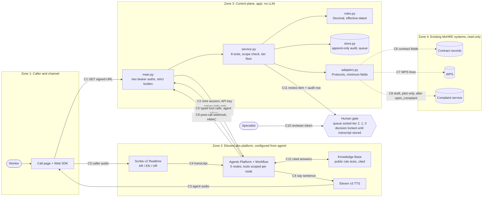
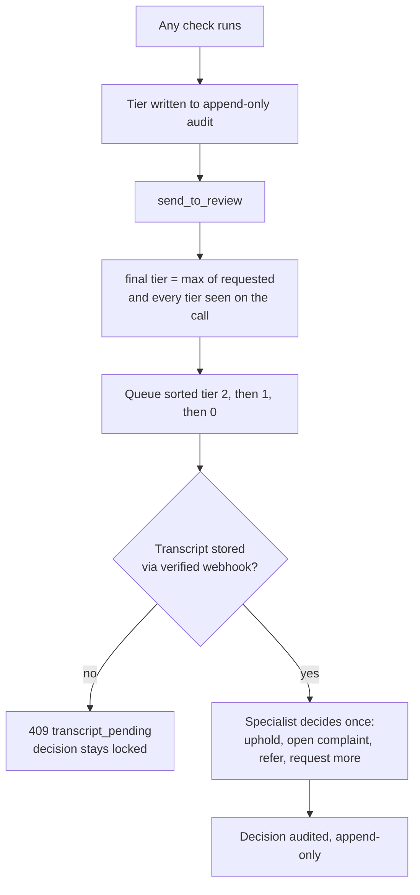

# Architecture

Four zones split by trust boundary, plus the human gate. Personal data only
crosses a boundary through a named, authenticated connection: every labelled
arrow below (C1-C11) appears in the connection table at the end. Solid
arrows are live in the build; dashed arrows run against synthetic stand-ins
now and become read-only integrations in a pilot. Fuller detail lives in
the module docstrings, `docs/adr/`, and the OpenAPI spec at `/docs`.

## Component view



Inside Zone 3 the layering rule (edge may import FastAPI/Pydantic/httpx;
domain and data are standard library only, dependencies pointing down)
is enforced by `tests/test_layering.py`, not by convention. The agent token
(C5) and the reviewer token (C10) are distinct and never interchangeable:
no decision capability is reachable with the agent token.

## One call, end to end

```mermaid
sequenceDiagram
  autonumber
  actor W as Worker
  participant P as Call page
  participant CP as Control plane
  participant EL as ElevenLabs agent
  participant R as Record adapters
  actor S as Specialist
  W->>P: Start call
  P->>CP: C1 GET /session/signed-url
  CP->>EL: C2 get-signed-url (API key server-side)
  EL-->>P: signed_url; C3 audio session opens
  EL-->>W: Node 1 disclosure (AI, recorded, information not advice)
  W->>EL: Worker ID, case ref, one-time code
  EL->>CP: C5 POST /tools/verify_session
  CP-->>EL: call bound to one worker + case
  W->>EL: "My July pay was short"
  EL->>CP: C5 POST /tools/check_wage (2026-07)
  CP->>R: C6/C7 contract wage + WPS line
  CP-->>EL: discrepancy AED 1000.00, tier, "say" sentence
  EL-->>W: speaks the say sentence, reads the amount back
  W->>EL: "Yes, prepare the draft"
  EL->>CP: C5 draft_complaint (confirmed) then send_to_review
  CP-->>EL: review ref, final tier (floor enforced)
  EL->>CP: C9 post-call webhook, HMAC verified
  S->>CP: C10 review queue, then one decision (unlocked by stored transcript)
```

## Tiers, decision lock and audit



Every tool call, refusal, webhook and decision writes an `audit_event` row;
database triggers block updates and deletes. Tiers set priority only;
every tier reaches a person.

## Connection table

| ID | From -> to | Protocol and auth | PII | On failure |
|---|---|---|---|---|
| C1 | Call page -> control plane `GET /session/signed-url` | HTTPS; rate-limited, no user auth in the build | No | 502 `signed_url_unavailable` |
| C2 | Control plane -> ElevenLabs `get-signed-url` | HTTPS; `xi-api-key` header, server-side only | No | 5 s timeout; 502 to caller |
| C3 | Browser <-> ElevenLabs conversation | WebSocket/WebRTC via Web SDK with signed URL | Yes | SDK error handlers; page offers retry |
| C4 | Scribe -> LLM -> workflow -> TTS | inside the platform | Yes | platform limits, node step caps |
| C5 | Agent workflow -> `POST /tools/*` | HTTPS; agent bearer token (platform secret); `conversation_id` from system dynamic variable, never the LLM | Yes | 5 s tool timeout; workflow edge to transfer |
| C6 | Control plane -> contract records | in-process synthetic now; read-only REST over mTLS in a pilot | Yes | fail closed, `dependency_unavailable` |
| C7 | Control plane -> WPS | as C6 | Yes | as C6 |
| C8 | Control plane -> complaint service | none in the build; pilot write only after a specialist decides `open_complaint` | Yes | queued and retried in pilot |
| C9 | ElevenLabs -> `POST /webhooks/elevenlabs/post-call` | HMAC-SHA256 over raw bytes, 30-min replay window | Yes | 401 on bad signature; duplicates ignored |
| C10 | Specialist browser -> `/review`, `/audit` | HTTPS; reviewer bearer token (SSO in pilot) | Yes | 409 `transcript_pending`, 409 `already_decided` |
| C11 | Service -> review queue | in-process; same transaction as the audit row | Yes | - |
| C12 | Agent <-> Knowledge Base | inside the platform; public rule texts only | No | answers cite their source |

Telephony over the 80084 number (SIP/Twilio) is the production channel and
intentionally out of the build; the same agent sits behind it unchanged.
